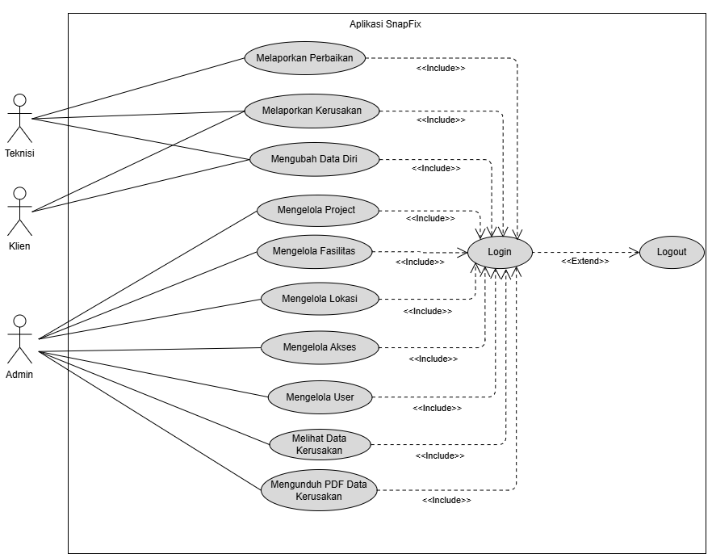
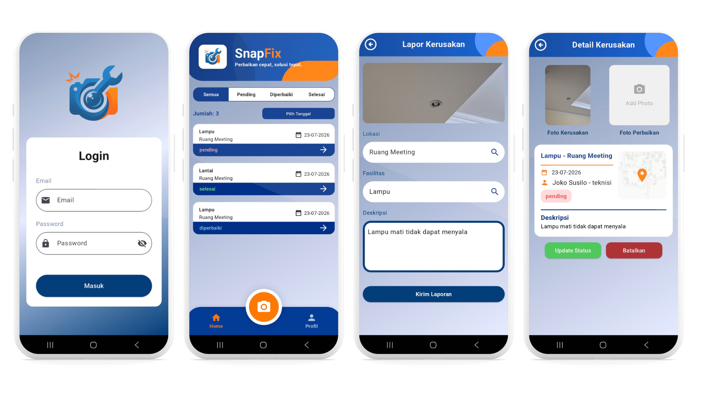
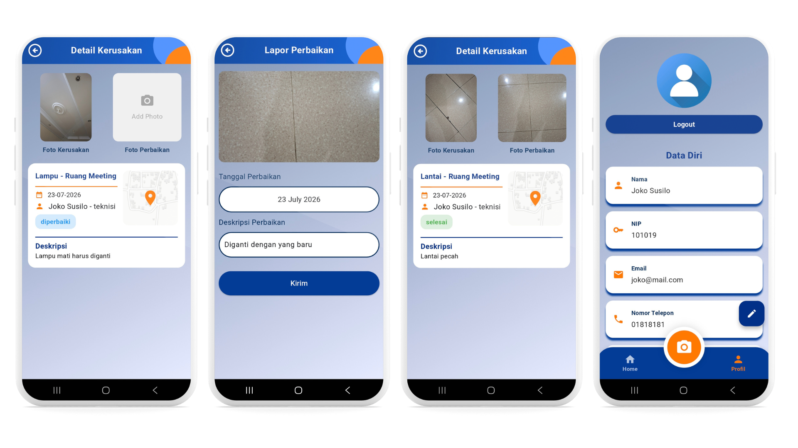
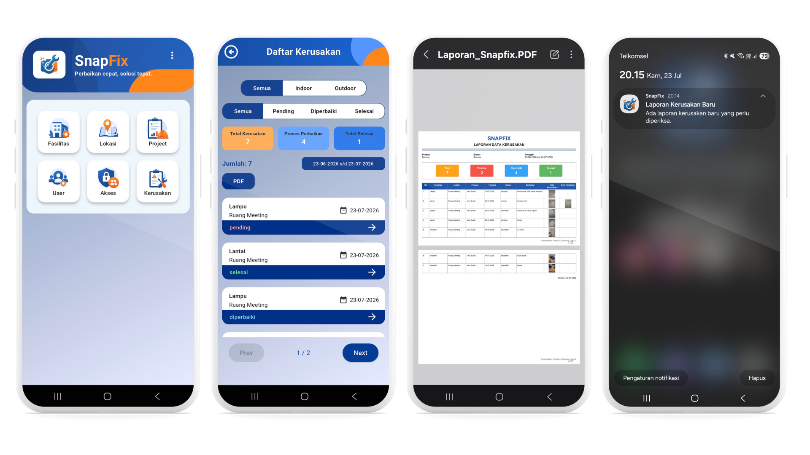

  

# 📱 SnapFix - Mobile App

> **SnapFix Mobile** aplikasi berbasis Flutter yang memungkinkan pengguna melaporkan kerusakan fasilitas secara real-time. Aplikasi ini menyediakan antarmuka yang intuitif untuk membuat laporan kerusakan maupun perbaikan dengan melampirkan foto sebagai bukti kondisi di lapangan serta menentukan lokasi menggunakan Google Maps. Pengguna juga dapat memantau status penanganan laporan, menerima notifikasi secara real-time, dan mengakses informasi kerusakan dengan aman melalui integrasi dengan SnapFix RESTful API Backend.

---

## 🛠️ Tech Stack & Arsitektur

- **Framework:** Flutter (Dart)
- **Architecture:** Clean Architecture (Presentation, Domain, Data)
- **State Management:** BLoC
- **Repository Pattern:** Repository Pattern
- **Networking:** RESTful API (HTTP)
- **Maps:** Google Maps Flutter
- **Push Notifications:** Firebase Cloud Messaging (FCM)
- **Local Notifications:** Flutter Local Notifications
- **Document Export:** PDF
- **Target Platform:** Android

---

## ✨ Fitur 

Berikut adalah fitur yang ada pada aplikasi SnapFix melalui use case diagram:

  

## 📱 Hasil Tampilan Aplikasi SnapFix

Berikut adalah beberapa tampilan hasil dari aplikasi SnapFix:

  

  

  

